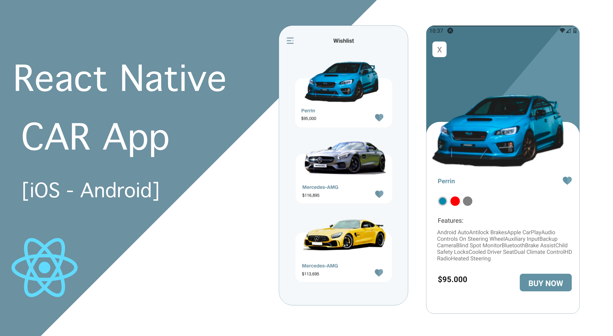
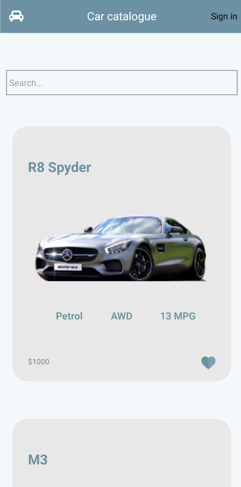
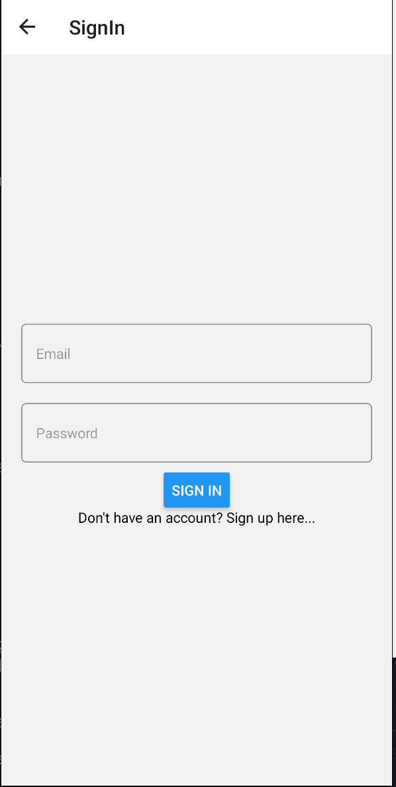
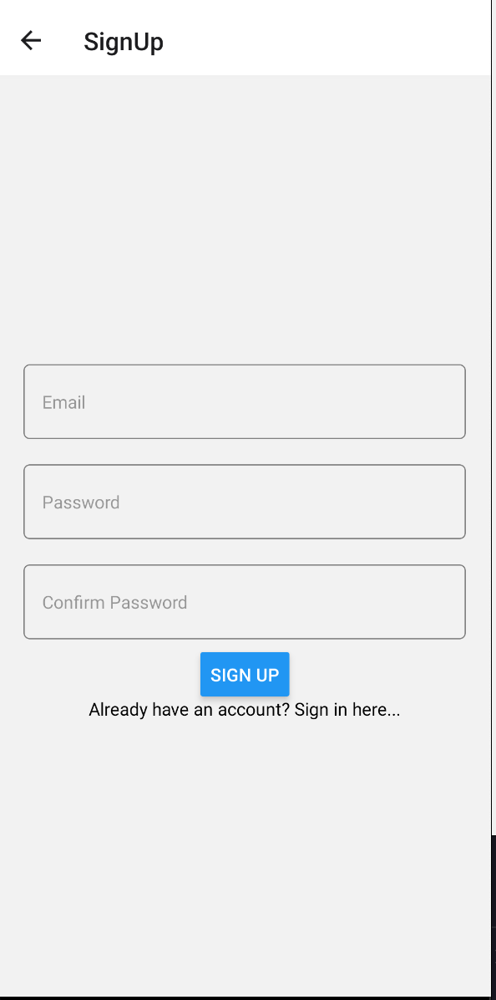
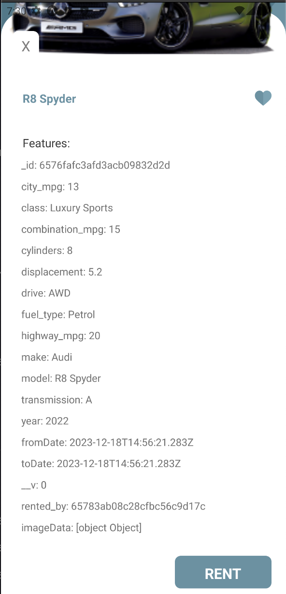
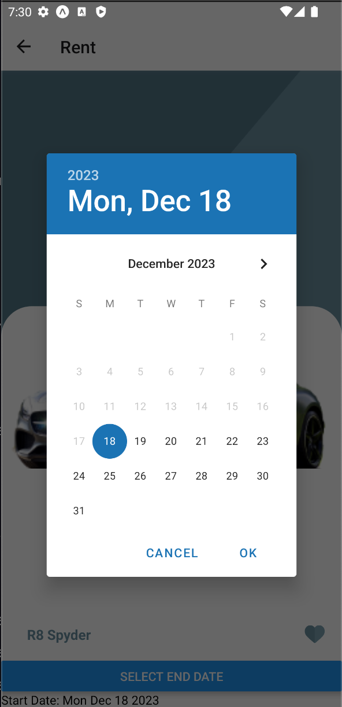
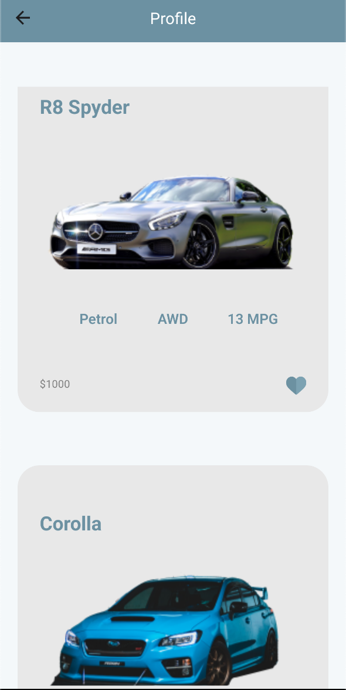

# 🛸 Car App With ReactNative - Expo Go

> ⚠️ [Please be sure your environment is set up correctly for React Native Expo.](https://reactnative.dev/docs/environment-setup)

## ⭐ Features

- [React Native Web](https://necolas.github.io/react-native-web/)
- [TypeScript](https://www.typescriptlang.org/)
- [React Navigation](https://reactnavigation.org/)
- [react-native-svg-transformer](https://yarnpkg.com/package/react-native-svg-transformer)
- [react-native-svg](https://yarnpkg.com/package/react-native-svg)

## Running the app

### Native

1. Start Metro Bundler: `yarn start`
2. Start the Android app: `yarn android`
3. Start the iOS app: `yarn ios` (make sure you have installed pods first! `yarn ios:pods` if needed)

## Development Tools

1. Check your code style with `yarn lint:all` (runs eslint, prettier, and tsc)
2. Check your code correctness with `yarn test:all` (runs jest)

## Youtube Speed code

## [Car App - Speed Code on YouTube](https://youtu.be/w1nzKJNcv_s)



### Cloning repo:

```
git clone https://github.com/Ivana140/car-hub.git
```

### Dependencies

- **React in Next.js:** Osnovna odvisnost za razvoj aplikacije (v 8.4.23 in 13.4.3).
- **Redux:** Za upravljanje globalnega stanja aplikacije (v 4.2.1).
- **Taiwind:** Za stiliranje izgleda plikacije (v 3.3.2).
- **Postcss:** Se uporablja poleg tailwind stiliranje izgleda plikacije (v 8.4.23).
- **Typescript:** Za določanje tipov in jasnejši zapis kode (v 5.0.4).
- **Autoprefixer:** Za avtomatsko dodajanje proizvajalčevih predpon (v 10.4.14).
- **Axios:** Za obravnavanje http zahtevkov (v 1.6.2).

- **@expo/vector-icons:** Provides a wide range of vector icons for Expo and React Native applications. (v13.0.0)
- **@react-native-community/datetimepicker:** A date and time picker component for React Native using the native date and time pickers on Android and iOS. (v7.0.0)
- **@react-navigation/native:** A navigation library for React Native that enables navigation using components such as Stack, Tabs, and Drawer. (v6.1.9)
- **@react-navigation/native-stack:** Provides a way for your app to transition between screens where each new screen is placed on top of a stack. (v6.9.17)
- **@react-navigation/stack:** A stack navigator component for React Navigation with a customizable header and a variety of transition options. (v6.2.3)
- **@types/base-64:** TypeScript definitions for the base-64 library which provides Base64 encoding and decoding. (v1.0.2)
- **axios:** A promise-based HTTP client for the browser and Node.js, ideal for making asynchronous HTTP requests. (v1.6.2)
- **base-64:** A JavaScript library for encoding and decoding strings into Base64 and vice versa. (v1.0.0)
- **expo:** An open-source platform for making universal native apps for Android, iOS, and the web with JavaScript and React. (v49.0.0)
- **expo-status-bar:** An Expo module that provides a React component for controlling the app's status bar. (v1.6.0)
- **react:** A JavaScript library for building user interfaces, typically used for single-page applications. (v18.2.0)
- **react-dom:** Serves as the entry point to the DOM and server renderers for React, intended for use with web projects. (v18.2.0)
- **react-native:** A framework for building native apps using React, it allows you to use React's component architecture for mobile app development. (v0.72.5)
- **react-native-gesture-handler:** Provides native-driven gesture management APIs for building best-in-class gesture experiences in React Native. (v2.12.0)
- **react-native-modal-datetime-picker:** A React Native date and time picker modal, using the native Android and iOS date and time pickers. (v17.1.0)
- **react-native-safe-area-context:** A flexible way to handle safe area insets, it also provides a hook and a higher-order component to manage insets. (v4.8.0)
- **react-native-screens:** Provides native navigation components for improved performance on both iOS and Android. (v3.29.0)
- **react-native-svg:** Allows you to use SVG files in your React Native applications, providing SVG support. (v13.9.0)
- **react-native-svg-transformer:** Enables importing and transforming SVG images in React Native projects as if they were React components. (v1.0.0)
- **react-native-web:** Makes it possible to run React Native components and APIs on the web using React DOM. (v0.19.6)
- **yarn:** A fast, reliable, and secure dependency management tool for JavaScript, it's used to install and manage project dependencies. (v1.22.21)

## App Demo:


On the starting page we can start exploring cars, after being welcomed.



Here we see available cars loaded from the database and their basic info.



Sign in page, wehere users can login.



Signup page where users can register.



Detailed info about the car and a rent button.



A page where we can select a date and rent after.



A profile page, where logged in users can view their rentals.
